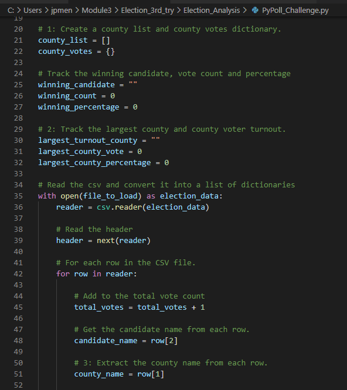
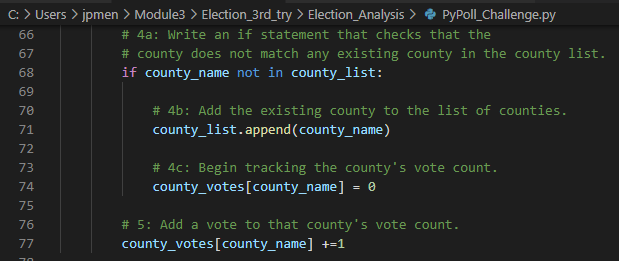

# Election_Analysis
## Project Overview

### A Colorado Board of Elections employee has given you the following tasks to complete the election audit of a recent local congressional election.
In this audit, the following objectives are listed below:
1. Calculate the total number of votes cast.
2. Get a complete list of candidates who received votes.
3. Calculate the total number of votes each candidate received.
4. Calculate the percentage of votes each candidate won.
5. Determine the winner of the election based on popular vote.

## Resources
- Data Source: election_results.csv
- Software: Python 3.7.6, Visual Studio Code, 1.58.1, GitBash 2.32.0, Microsoft Excel 2016
## Election-Audit Results

### Summary of Audit Results

The graphic above shows there were a total of 369,711 votes cast in the election.  

List of Candidates:
- Charles Casper Stockham (85,213 votes, 23.0% of the vote)
- Diana DeGette (272,892 votes, 73.8% of the vote)
- Raymon Anthony Doane (11,606 votes, 3.1% of the vote)

The audit confirmed that Diana DeGette was the winner with 272,892 votes, taking 73.8% of the total vote.  The audit also revealed Denver County had the largest turnout with 306,055 votes, which represents 82.8% of the vote.

## Challenge Overview
### The PyPoll_Challenge - Election Commission Requests
Below are snapshots of the python code required to complete the election commissions request and the steps required to fulfill each part of the challenge.

- Step 1:

Initialize a county list, like the candidate_options list, that will hold the names of the counties.
Initialize a dictionary, like the candidate_votes dictionary, that will hold the county as the key and the votes cast for each county as the values.
- Step 2:

Initialize an empty string, like winning_candidate, that will hold the county name for the county with the largest turnout.
Initialize a variable, like the winning_count variable, that will hold the number of votes of the county that had the largest turnout.
- Step 3:

While reading the election results from each row inside the for loop, write a script that gets the county name from each row.

- Step 4a:

Write a decision statement with a logical operator to check if the county name acquired in Step 3 is in the county list you created in Step 1.
- Step 4b:

If the county is not in the list created in Step 1, add it to the list of county names like you did when adding a candidate to the candidate_options list.
-Step 4c:

Write a script that initializes the county vote to zero, like you did when you began to track the vote counts for the candidates.
- Step 5:

Write a script that adds a vote to the county’s vote count as you are looping through all the rows, like you did for the candidate’s vote count.

- Step 6a:

Write a repetition statement to get the county from the county dictionary that was created in Step 1.
- Step 6b:

Initialize a variable to hold the county’s votes as they are retrieved from the county votes dictionary.
- Step 6c:

Write a script that calculates the county’s votes as a percentage of the total votes.
- Step 6d:

Write a print statement that prints the current county, its percentage of the total votes, and its total votes to the command line.

- Step 6e:

Write a script that saves each county, the county’s total votes, and the county’s percentage of total votes to the election_results.txt file.

- Step 6f:

Write a decision statement that determines the county with the largest vote count and then adds that county and its vote count to the variables created in Step 2.
- Step 7:

Write a print statement that prints out the county with the largest turnout.
- Step 8:

Write a script that saves the county with the largest turnout to the election_results.txt file.

## Challenge Summary
The combination of tools utilized here is 
